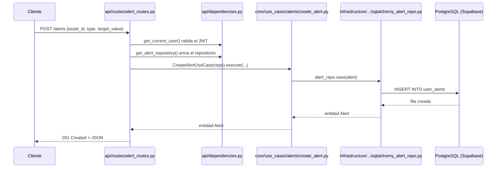
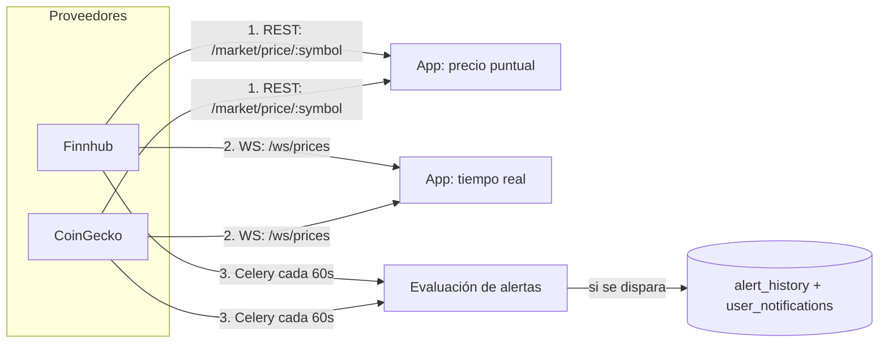

# Guía del backend InFinance — cómo está construido y cómo modificarlo sin romper nada

Esta guía explica, con lenguaje simple, cómo está armado el backend en `trading-backend/`
y qué reglas seguir para agregar o modificar cosas sin romper el resto del sistema.

---

## 1. La idea general: arquitectura hexagonal (puertos y adaptadores)

El backend está separado en capas. La regla de oro es: **las capas de "adentro" no
saben nada de las capas de "afuera"**.

```
src/
├── core/            <- El "cerebro" del negocio. NO sabe qué es FastAPI, SQLAlchemy, HTTP, etc.
│   ├── entities/     <- Clases de negocio puras (Alert, Asset, Watchlist, Dividend, Notification)
│   ├── ports/        <- Interfaces (contratos) que dicen QUÉ se necesita, no CÓMO se hace
│   └── use_cases/    <- La lógica de cada acción (crear alerta, evaluar alertas, etc.)
│
├── infrastructure/   <- El "cómo". Implementa los ports usando tecnologías reales.
│   ├── database/      <- SQLAlchemy: modelos de tablas + repositorios (implementan los ports)
│   ├── external/       <- Clientes HTTP a Finnhub y CoinGecko
│   ├── celery/         <- Tareas en background (evaluar alertas cada 60s)
│   └── config.py       <- Variables de entorno (.env)
│
├── api/              <- La puerta de entrada HTTP/WebSocket.
│   ├── routes/         <- Endpoints REST (uno por recurso: alerts, watchlists, etc.)
│   ├── websocket/       <- Streaming de precios en tiempo real
│   └── dependencies.py <- "Fábricas" que arman los objetos que cada endpoint necesita
│
├── shared/           <- Utilidades transversales (logger, helpers)
└── main.py           <- Arranca la app de FastAPI y conecta todos los routers
```

### Por qué importa esto

- Si mañana cambian Supabase/Postgres por otra base de datos, **solo tocás `infrastructure/database/`**.
  El `core/` (las reglas de negocio) no se toca.
- Si querés testear la lógica de negocio, no necesitás levantar una base de datos real:
  los `use_cases` reciben los repositorios por parámetro (inyección de dependencias),
  así que en los tests les pasás versiones falsas ("mocks" o "fakes").

### La regla que NUNCA hay que romper

> `src/core/` no puede importar nada de `src/infrastructure/` ni de `src/api/`.

Si alguna vez ves un `import` de SQLAlchemy, FastAPI, `httpx`, etc. dentro de
`src/core/`, algo está mal armado.

---

## 2. El flujo de una request típica (ejemplo: crear una alerta)



Cada endpoint sigue este mismo patrón:

1. **Route** recibe el request, valida el body con un modelo Pydantic (`CreateAlertRequest`, etc.).
2. **Dependencies** (`Depends(...)`) resuelven quién es el usuario (JWT) y crean el repositorio conectado a la sesión de BD.
3. **Use case** ejecuta la lógica de negocio, sin saber nada de HTTP.
4. La route traduce el resultado (o la excepción) a una respuesta HTTP.

---

## 3. Autenticación (JWT de Supabase vía JWKS)

- El JWT viaja en el header `Authorization: Bearer <token>`.
- `src/api/dependencies.py` → `get_current_user()` valida la firma del token
  **localmente** usando la clave pública que publica Supabase en su endpoint JWKS
  (`SUPABASE_JWKS_URL` en el `.env`, con formato
  `https://<proyecto>.supabase.co/auth/v1/.well-known/jwks.json`).
- Se usa `PyJWKClient` (de PyJWT): descarga las claves públicas y las cachea, así que
  **no se llama a Supabase en cada request**.
- Algoritmos aceptados: `RS256` y `ES256` (asimétricos). Ya **no** se usa
  `SUPABASE_JWT_SECRET` (esquema HS256 legacy).
- El `user_id` sale del campo `sub` del token y se exige `aud == "authenticated"`.
- **No usamos cookies** (`allow_credentials=False` en el CORS de `main.py`), porque el
  token siempre va en el header. Si algún día agregan login con cookies, hay que revisar
  esa configuración de CORS.
- La conexión a la base de datos sale de `DATABASE_URL` (la `Settings` normaliza
  automáticamente `postgresql://` a `postgresql+asyncpg://` para el engine async).
  Al usar credenciales de servicio de Supabase, **se saltea el Row Level Security (RLS)**.
  Por eso cada use case que toca datos de un usuario (ej. `AddAssetToWatchlistUseCase`)
  valida a mano que el `user_id` sea dueño del recurso, lanzando `UnauthorizedError` si no.
  **Nunca asumas que RLS te va a proteger acá** — la seguridad se controla
  explícitamente en el código.

---

## 4. Endpoints REST y WebSocket (para probar con Postman)

Base URL local: `http://localhost:8000` (el puerto viene de `PORT` en el `.env`).

### Cómo autenticar en Postman

1. Conseguí un _access token_ de Supabase (login real desde la app, o desde
   Authentication → Users en el dashboard de Supabase).
2. En cada request protegido agregá el header: `Authorization: Bearer <access_token>`.
3. Tip: en Postman podés configurarlo una sola vez a nivel colección
   (pestaña _Authorization_ → _Type: Bearer Token_) y los requests lo heredan.

### Endpoints públicos (sin JWT)

| Método | Ruta      | Descripción                      |
| ------ | --------- | -------------------------------- |
| GET    | `/`       | Mensaje de bienvenida + versión  |
| GET    | `/health` | Health check (`{"status":"ok"}`) |

### Auth (`/auth`)

| Método | Ruta       | Descripción                                                             |
| ------ | ---------- | ----------------------------------------------------------------------- |
| GET    | `/auth/me` | Devuelve `{"user_id": ...}`. Ideal para verificar que el JWT es válido. |

### Watchlists (`/watchlists`)

| Método | Ruta                                           | Body                  | Respuesta       |
| ------ | ---------------------------------------------- | --------------------- | --------------- |
| POST   | `/watchlists`                                  | `{"name": "Crypto"}`  | 201 + watchlist |
| GET    | `/watchlists`                                  | —                     | 200 + lista     |
| DELETE | `/watchlists/{watchlist_id}`                   | —                     | 204             |
| POST   | `/watchlists/{watchlist_id}/assets`            | `{"asset_id": "..."}` | 204             |
| DELETE | `/watchlists/{watchlist_id}/assets/{asset_id}` | —                     | 204             |

### Alertas (`/alerts`)

| Método | Ruta                 | Body / Params                                                                     | Respuesta   |
| ------ | -------------------- | --------------------------------------------------------------------------------- | ----------- |
| POST   | `/alerts`            | `{"asset_id":"...","type":"price_target","condition":"above","target_value":200}` | 201 + alert |
| GET    | `/alerts`            | —                                                                                 | 200 + lista |
| GET    | `/alerts/history`    | Query opcionales: `asset_id`, `is_active`, `date_from`, `date_to` (ISO 8601)      | 200 + lista |
| PATCH  | `/alerts/{alert_id}` | `{"condition":"below","target_value":150,"is_active":true}` (todos opcionales)    | 200 + alert |
| DELETE | `/alerts/{alert_id}` | —                                                                                 | 204         |

- `type` válidos: `price_target`, `percent_variation`, `indicator`, `dividend`.
- `condition` válidos: `above`, `below`, `crosses_up`, `crosses_down`.
- Ojo: `/alerts/history` es una ruta fija; no la confundas con `/alerts/{alert_id}`.

### Mercado (`/market`)

| Método | Ruta                       | Params                                                          | Respuesta                            |
| ------ | -------------------------- | --------------------------------------------------------------- | ------------------------------------ |
| GET    | `/market/assets`           | Query opcional: `asset_type` (ej. `stock`)                      | 200 + lista de assets                |
| GET    | `/market/price/{symbol}`   | ej. `/market/price/AAPL`                                        | `{"symbol":"AAPL","price": ...}`     |
| GET    | `/market/history/{symbol}` | Query opcional: `interval` = `1D`/`1W`/`1M`/`1Y` (default `1D`) | 200 + `[{timestamp, price, volume}]` |

### Dividendos (`/dividends`)

| Método | Ruta                    | Body                                                                                                         | Respuesta   |
| ------ | ----------------------- | ------------------------------------------------------------------------------------------------------------ | ----------- |
| GET    | `/dividends/{asset_id}` | —                                                                                                            | 200 + lista |
| POST   | `/dividends`            | `{"asset_id":"...","amount":0.24,"yield_value":0.5,"pay_date":"2026-10-01","ex_dividend_date":"2026-09-15"}` | 201         |

### Notificaciones (`/notifications`)

| Método | Ruta                                    | Params                             | Respuesta          |
| ------ | --------------------------------------- | ---------------------------------- | ------------------ |
| GET    | `/notifications`                        | Query opcional: `unread_only=true` | 200 + lista        |
| PATCH  | `/notifications/{notification_id}/read` | —                                  | 200 + notificación |

### WebSocket (stream de precios en tiempo real)

| Protocolo | Ruta                                    | Descripción                                                                                                                                                            |
| --------- | --------------------------------------- | ---------------------------------------------------------------------------------------------------------------------------------------------------------------------- |
| WS        | `/ws/prices?symbol=AAPL&source=finnhub` | Envía `{"symbol":"AAPL","price": ...}` cada ~5 segundos. `source` admite `finnhub` (default) o `coingecko`. **No pide JWT**: es solo visualización, no evalúa alertas. |

En Postman: _New → WebSocket Request_ → `ws://localhost:8000/ws/prices?symbol=AAPL` → _Connect_.

### Códigos de error típicos

| Código | Cuándo aparece                                                         |
| ------ | ---------------------------------------------------------------------- |
| 401    | Falta el token, es inválido/expiró, o el `sub` está vacío              |
| 403    | El recurso existe pero pertenece a otro usuario                        |
| 404    | El recurso o el asset no existe                                        |
| 400    | Regla de negocio violada (nombre vacío, duplicado, condición inválida) |
| 502    | Falló el proveedor externo (Finnhub/CoinGecko)                         |

ambos documentos no queden desactualizados entre sí.

## 5. Precios y mercado: cómo se actualizan (y por qué NO se guardan)

### La idea clave

**Los precios NO se guardan en la base de datos.** No existe tabla de precios.
Se obtienen **en vivo** de Finnhub/CoinGecko cada vez que se necesitan, y se usan
en el momento. Lo único que guardamos del mercado es el **catálogo de activos**
(`financial_assets`) y el **historial de alertas disparadas** (`alert_history`,
cuando se dispara una alerta). Nada más.

Esto es intencional: guardar precios históricos cuesta almacenamiento y los proveedores
gratuitos ya limitan cuánto histórico dan. Para el alcance del TFM alcanza con
consultarlos al vuelo.

### Los 3 caminos por los que "fluye" un precio



1. **REST `/market/price/{symbol}`** — la app pide el precio actual una vez.
   Se usa en el detalle del activo como valor base. Además la app lo vuelve a pedir
   sola cada ~15 segundos (polling) como respaldo si el WebSocket no está conectado.

2. **WebSocket `/ws/prices?symbol=X&source=Y`** — mantiene una conexión abierta y envía
   `{"symbol":"AAPL","price": ...}` cada ~5 segundos. Es solo **visualización**:
   no guarda nada y no evalúa alertas (esa separación es intencional, ver ADR-003).
   Respeta el límite del plan free (Finnhub ~60 llamadas/min, CoinGecko ~10/min).

3. **Celery cada 60 s** (`evaluate_alerts_task.py`) — para cada alerta activa busca
   el precio en vivo, lo compara con el objetivo y, si se dispara, **sí guarda**:
   una notificación (`user_notifications`) y una fila en `alert_history`.
   Este es el único lugar donde un precio deja rastro en la BD.

### De dónde sale la lista de activos

`/market/assets` **lee la tabla `financial_assets`**, NO consulta a Finnhub/CoinGecko.
Los proveedores externos solo se usan para precios (actual e histórico). Por eso,
si la tabla está vacía, la pantalla de mercado sale vacía aunque los proveedores
funcionen perfecto.

### Cómo poblar/actualizar el catálogo (seed)

El catálogo se puebla con un script idempotente (se puede correr mil veces sin
duplicar: salta los símbolos que ya existen):

```powershell
cd trading-backend
.\venv\Scripts\python.exe scripts\seed_assets.py
# -> "seed_assets: N inserted, M already existed"
```

Para **agregar más activos**, editá las listas `STOCKS` / `CRYPTOS` dentro de
`scripts/seed_assets.py` y volvé a correrlo.

Regla importante para cripto: el `CoinGeckoClient` traduce tickers a IDs de CoinGecko
mediante el diccionario `_SYMBOL_TO_ID` (en `infrastructure/external/coingecko_client.py`).
Si agregás una cripto al seed, **agregala también a ese diccionario** o el precio fallará.

### Catálogo actual (sembrado el 2026-09-23)

| Tipo     | Fuente    | Símbolos                                                           |
| -------- | --------- | ------------------------------------------------------------------ |
| `stock`  | Finnhub   | AAPL, MSFT, GOOGL, AMZN, TSLA, NVDA, META, NFLX, AMD, INTC, JPM, V |
| `crypto` | CoinGecko | BTC, ETH, USDT, BNB, SOL, XRP, ADA, DOGE                           |

Total: **20 activos**. Verificado en vivo con planes free (Finnhub y CoinGecko
responden precio real para estos símbolos).

### Cómo verificar precios e históricos

Con el backend corriendo, todo desde PowerShell (sin token solo falla con 401, así que
estas pruebas van directo a los clientes, no al endpoint):

```powershell
cd trading-backend

# Precio actual de una acción (Finnhub) y una cripto (CoinGecko):
.\venv\Scripts\python.exe -c "import asyncio; from src.infrastructure.external.finnhub_client import FinnhubClient; print(asyncio.run(FinnhubClient().get_price('AAPL')))"
.\venv\Scripts\python.exe -c "import asyncio; from src.infrastructure.external.coingecko_client import CoinGeckoClient; print(asyncio.run(CoinGeckoClient().get_price('BTC')))"

# Histórico diario (Finnhub, últimos ~30 días):
.\venv\Scripts\python.exe -c "import asyncio, datetime; from src.infrastructure.external.finnhub_client import FinnhubClient; end=datetime.datetime.now(datetime.timezone.utc); start=end-datetime.timedelta(days=30); print(asyncio.run(FinnhubClient().get_historical('AAPL', start, end))[-3:])"
```

Y el endpoint real (con JWT) es:

```
GET /market/history/AAPL?interval=1M   # 1D | 1W | 1M | 1Y
```

El backend elige el proveedor correcto solo, según la columna `source_api` del activo:
`stock` → Finnhub, `crypto` → CoinGecko. En la app, los históricos se ven en el
gráfico del detalle de cada activo (selector 1D/1W/1M/1Y).

### Sobre índices bursátiles (alcance del plan free)

Sí, "índices" = índices bursátiles (S&P 500, Nasdaq, Dow Jones...). **El plan free de
Finnhub NO da datos de índices** (son endpoints pagos), por eso el catálogo no incluye
ninguno de tipo `index`. Lo mismo aplica al histórico. Si más adelante querés índices,
habría que sumar un proveedor que los cubra gratis (ver sección "Caso D") o aceptar
un plan pago. Forex gratis sí existe en Finnhub, pero usa símbolos tipo `OANDA:EUR_USD`,
feos para mostrar al usuario; quedó fuera del catálogo inicial a propósito.

### ¿Cuándo se actualizan los datos? (resumen rápido)

| Dato                 | ¿Se guarda en BD?         | ¿Cómo se actualiza?                                             |
| -------------------- | ------------------------- | --------------------------------------------------------------- |
| Catálogo de activos  | Sí (`financial_assets`)   | Solo cuando corrés `seed_assets.py`                             |
| Precio actual        | No                        | En vivo: REST (cada pedido / polling 15s) o WebSocket (cada 5s) |
| Histórico de precios | No                        | Se pide en vivo al proveedor en cada consulta                   |
| Alertas disparadas   | Sí (`alert_history`)      | Celery cada 60 s, solo cuando se dispara                        |
| Notificaciones       | Sí (`user_notifications`) | Celery cada 60 s, junto con la alerta                           |

---

---

## 6. Manejo de errores (cómo se traduce un error de negocio a un código HTTP)

En `src/core/exceptions.py` hay 4 excepciones base:

| Excepción              | Significado                           | Código HTTP típico |
| ---------------------- | ------------------------------------- | ------------------ |
| `DomainError`          | Regla de negocio violada (clase base) | 400                |
| `NotFoundError`        | El recurso no existe                  | 404                |
| `UnauthorizedError`    | El usuario no es dueño del recurso    | 403                |
| `ExternalServiceError` | Falló Finnhub/CoinGecko               | 502/503            |

Los `use_cases` lanzan estas excepciones. Las `routes` las atrapan con `try/except`
y las convierten a `HTTPException` (ver `alert_routes.py` como ejemplo). **Si agregás
un use case nuevo, seguí el mismo patrón**: lanzar la excepción de dominio adecuada
adentro del use case, y atraparla en la route correspondiente.

## 7. Cómo agregar funcionalidad nueva sin romper nada

### Caso A: Agregar un endpoint a un recurso que ya existe (ej. un campo nuevo en Alert)

1. Agregá el campo en la entidad (`src/core/entities/alert.py`).
2. Agregá la columna en el modelo SQLAlchemy (`src/infrastructure/database/models.py`)
   y creá la migración de base de datos correspondiente (Alembic).
3. Actualizá el repositorio (`sqlalchemy_alert_repo.py`) en `_to_entity()` y en los
   métodos `save`/`update` para que lean/escriban el campo nuevo.
4. Actualizá el modelo Pydantic del request/response en `alert_routes.py`.
5. Corré los tests (`pytest`) para confirmar que nada se rompió.

### Caso B: Agregar un recurso completamente nuevo (ej. "Portfolio")

Copiá el patrón que ya existe para `watchlist` o `alert`:

1. `src/core/entities/portfolio.py` — la clase de negocio pura.
2. `src/core/ports/portfolio_repository.py` — la interfaz (métodos abstractos).
3. `src/core/use_cases/portfolio/` — una clase por acción (crear, listar, borrar...).
4. `src/infrastructure/database/models.py` — el modelo de tabla (si la tabla ya existe
   en el diccionario de base de datos, usá exactamente esos nombres de columnas).
5. `src/infrastructure/database/repositories/sqlalchemy_portfolio_repo.py` — implementa
   el port usando SQLAlchemy.
6. `src/api/routes/portfolio_routes.py` — los endpoints, siguiendo el patrón de
   `alert_routes.py` (try/except de excepciones de dominio, modelos Pydantic, etc.).
7. Registrá el router nuevo en `src/main.py` (`app.include_router(...)`).
8. Agregá el "fabricador" del repositorio en `src/api/dependencies.py` (algo como
   `get_portfolio_repository(session = Depends(get_db))`).
9. Escribí tests en `tests/unit/` (para el use case, con repos falsos) y opcionalmente
   en `tests/integration/` (para el endpoint HTTP completo).

### Caso C: Agregar una tarea en background (ej. otra evaluación periódica)

- Mirá `src/infrastructure/celery/tasks/evaluate_alerts_task.py` como plantilla.
- Registrala en `src/infrastructure/celery/config.py` (beat schedule) si tiene que
  correr periódicamente.
- **Importante**: el WebSocket de precios (`api/websocket/price_stream.py`) solo
  transmite precios, no evalúa alertas. Esa separación es intencional (ver ADR-003 en
  el plan de arquitectura) — no mezcles esa lógica.

### Caso D: Agregar un nuevo proveedor de datos de mercado (además de Finnhub/CoinGecko)

1. Creá el cliente en `src/infrastructure/external/`, respetando la interfaz
   `MarketDataProviderPort` (`src/core/ports/market_data_provider.py`).
2. Agregalo al diccionario `_PROVIDERS` donde se usa (`evaluate_alerts_task.py`,
   `market_routes.py`) usando el mismo `source_api` que en la tabla `assets`.

---

## 8. Reglas para no romper nada (checklist antes de hacer un cambio)

- [ ] ¿Mi cambio en `core/` importa algo de `infrastructure/` o `api/`? → **No debería.**
- [ ] ¿Agregué una excepción de dominio nueva? → Atrapala en la route con el código HTTP correcto.
- [ ] ¿Cambié una tabla? → Actualizá `models.py` **y** el diccionario de base de datos en
      `docs/DICCIONARIO_BASE_DATOS_INFInance_COMPLETO.txt`, y generá una migración Alembic
      (no edites tablas a mano en producción).
- [ ] ¿Toqué `src/infrastructure/config.py`? → Agregá la variable nueva también en
      `.env` para que quede documentada.
- [ ] ¿Corriste `pytest` después del cambio? Todos los tests existentes deben seguir en verde.
- [ ] ¿El endpoint nuevo necesita autenticación? → Agregá `user_id: str = Depends(get_current_user)`.
- [ ] ¿El use case toca datos de un usuario específico? → Validá que `user_id` sea dueño
      del recurso (mismo patrón que `AddAssetToWatchlistUseCase`), porque RLS está bypaseado.

---

## 9. Cómo correr y probar el backend localmente

El proyecto ya tiene un entorno virtual en `trading-backend/venv/` con Python 3.14.
**Usá siempre el Python de ese venv**, no el de tu sistema:

```powershell
cd trading-backend
.\venv\Scripts\Activate.ps1

# Instalar/actualizar dependencias
pip install -r requirements.txt

# Correr todos los tests
python -m pytest -v

# Levantar el servidor (necesita el .env completo: SUPABASE_JWKS_URL, DATABASE_URL, etc.)
# El .env ya existe en trading-backend/.env y está ignorado por git (no se sube).
uvicorn main:app --reload
```

Después podés probar los endpoints de la sección 4 con Postman contra
`http://localhost:8000`. Recordá: el `.env` lo lee `src/infrastructure/config.py`
(`Settings`), que normaliza `postgresql://` a `postgresql+asyncpg://`.

Si `pip install` falla con errores de compilación (por ejemplo en `greenlet` o `asyncpg`),
es porque el paquete pinneado en `requirements.txt` no tiene versión precompilada para
Python 3.14. La solución es subir esa versión en `requirements.txt` a una más reciente
que sí tenga wheel para `cp314` (podés verificarlo con `pip index versions <paquete>`).

---

## 10. Dónde está cada cosa (mapa rápido)

| Quiero...                                                       | Voy a...                                                    |
| --------------------------------------------------------------- | ----------------------------------------------------------- |
| Cambiar una regla de negocio (ej. cuándo se dispara una alerta) | `src/core/entities/alert.py` → método `is_triggered`        |
| Agregar un endpoint nuevo                                       | `src/api/routes/`                                           |
| Cambiar cómo se guarda algo en la base de datos                 | `src/infrastructure/database/repositories/`                 |
| Cambiar el esquema de una tabla                                 | `src/infrastructure/database/models.py` + migración Alembic |
| Cambiar variables de entorno / configuración                    | `src/infrastructure/config.py` + `.env`                     |
| Cambiar la tarea que evalúa alertas cada 60s                    | `src/infrastructure/celery/tasks/evaluate_alerts_task.py`   |
| Agregar un proveedor de precios nuevo                           | `src/infrastructure/external/`                              |
| Escribir un test de lógica de negocio (sin BD real)             | `tests/unit/`                                               |
| Escribir un test de un endpoint HTTP completo                   | `tests/integration/`                                        |

---

## 11. Documentos de referencia

- Plan de arquitectura completo (con los ADR / decisiones de diseño):
  [Plan_Arquitectura_Backend_InFinance_DEFINITIVO_FINAL.md](Plan_Arquitectura_Backend_InFinance_DEFINITIVO_FINAL.md)
- Diccionario de base de datos (tablas, columnas, relaciones):
  [DICCIONARIO_BASE_DATOS_INFInance_COMPLETO.txt](DICCIONARIO_BASE_DATOS_INFInance_COMPLETO.txt)

Cualquier cambio grande de arquitectura debería reflejarse también en el plan, para que
ambos documentos no queden desactualizados entre sí.
