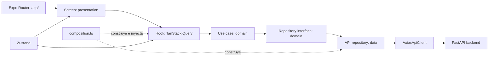
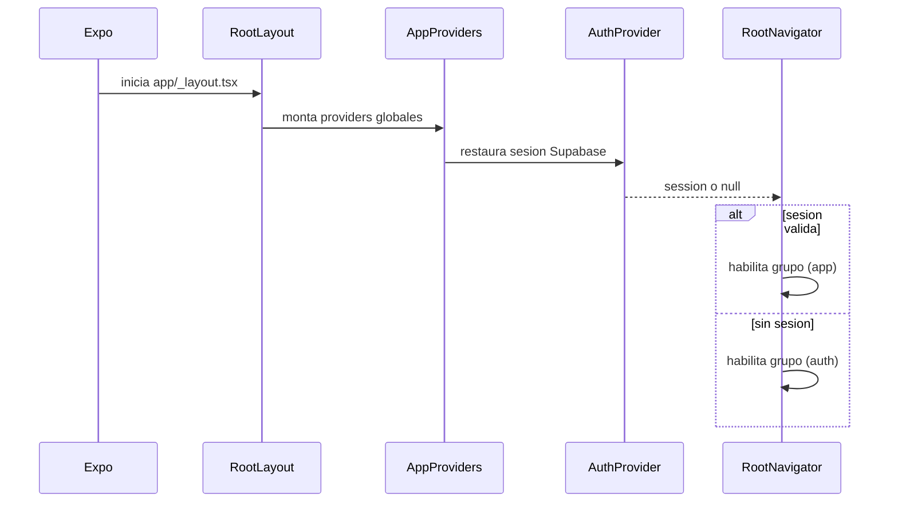
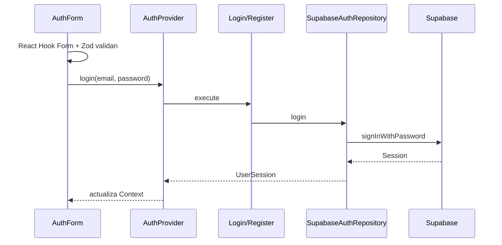

# Guia del frontend de InFinance

> Fotografia tecnica verificada contra el codigo el 17 de septiembre de 2026.
> Esta guia describe lo que existe hoy. Si el codigo cambia, hay que actualizarla.

## 1. Objetivo de esta guia

Este documento sirve para:

- entender como arranca y navega la aplicacion;
- saber donde vive cada responsabilidad;
- seguir el recorrido completo desde una pantalla hasta el backend;
- conocer las librerias instaladas y su uso real;
- agregar funcionalidades sin romper las capas existentes;
- ejecutar las comprobaciones correctas antes de dar un cambio por terminado.

El frontend es una aplicacion universal construida con Expo SDK 54, React 19,
React Native 0.81 y TypeScript estricto. Funciona sobre Android, iOS y web.

## 2. Modelo mental en 30 segundos

La aplicacion usa una Clean Architecture pragmatica organizada por feature.



Regla principal:

```text
app -> presentation -> domain <- data -> infrastructure
```

El dominio no debe importar React, Expo Router, Axios, Supabase ni componentes.
Las implementaciones externas dependen de interfaces del dominio, no al reves.

## 3. Estructura real del proyecto

```text
trading-frontend/
|- app/                       Rutas de Expo Router; deben ser delgadas
|  |- _layout.tsx             Providers, proteccion de sesion y Stack raiz
|  |- (auth)/                 Login y registro sin tabs
|  |- (app)/                  Aplicacion autenticada con tabs
|  `- +not-found.tsx          Ruta desconocida
|- src/
|  |- features/               Funcionalidad separada por dominio
|  |  |- auth/
|  |  |- market/
|  |  |- charts/
|  |  |- watchlists/
|  |  |- alerts/
|  |  |- notifications/
|  |  `- profile/
|  |- infrastructure/         HTTP, Supabase, WebSocket, entorno y composition
|  |- providers/              Contextos globales de React
|  |- shared/                 UI, strings, errores y tema reutilizables
|  `- store/                  Estado de cliente con Zustand
|- tests/                     Pruebas unitarias e integracion de UI
|- assets/                    Imagenes empaquetadas por Expo
|- components/, hooks/,
|  constants/                 Archivos starter antiguos; no son la UI principal
|- app.json                   Configuracion de Expo
|- package.json               Dependencias y scripts
|- tsconfig.json              TypeScript estricto y alias
`- jest.config.js             Jest con preset jest-expo
```

### Alias de imports

- `@/*` apunta a `src/*`. Es el alias normal de la aplicacion.
- `~/*` apunta a la raiz. Solo se conserva para archivos starter antiguos.

En codigo nuevo bajo `src/`, usar `@/`.

## 4. Arranque de la aplicacion

El punto de entrada declarado en `package.json` es `expo-router/entry`.
Expo Router carga `app/_layout.tsx`.



`AppProviders` monta, de afuera hacia adentro:

1. `AppThemeProvider` para colores y modo global.
2. `QueryProvider` para cache y operaciones remotas.
3. `AuthProvider` para sesion y acciones de autenticacion.

Mientras Supabase restaura la sesion, se muestra `StateView` en modo carga.
`Stack.Protected` decide si el usuario puede ver `(auth)` o `(app)`.

## 5. Mapa de navegacion

Los grupos entre parentesis organizan archivos, pero no aparecen en la URL.

| URL               | Archivo de ruta                     | Pantalla real           |
| ----------------- | ----------------------------------- | ----------------------- |
| `/` autenticado   | `app/(app)/index.tsx`               | redirige a `/market`    |
| `/login`          | `app/(auth)/login.tsx`              | `LoginScreen`           |
| `/register`       | `app/(auth)/register.tsx`           | `RegisterScreen`        |
| `/market`         | `app/(app)/market/index.tsx`        | `MarketScreen`          |
| `/market/:symbol` | `app/(app)/market/[symbol].tsx`     | `AssetDetailScreen`     |
| `/watchlists`     | `app/(app)/watchlists/index.tsx`    | `WatchlistsScreen`      |
| `/watchlists/:id` | `app/(app)/watchlists/[id].tsx`     | `WatchlistDetailScreen` |
| `/alerts`         | `app/(app)/alerts/index.tsx`        | `AlertsScreen`          |
| `/alerts/create`  | `app/(app)/alerts/create.tsx`       | `CreateAlertScreen`     |
| `/alerts/history` | `app/(app)/alerts/history.tsx`      | `AlertHistoryScreen`    |
| `/notifications`  | `app/(app)/notifications/index.tsx` | `NotificationsScreen`   |
| `/profile`        | `app/(app)/profile/index.tsx`       | `ProfileScreen`         |

`app/(app)/_layout.tsx` crea los tabs Mercado, Listas, Alertas,
Notificaciones y Perfil. Colores, titulos e iconos se configuran ahi.

Una ruta debe limitarse a exportar una pantalla, leer parametros de navegacion
cuando sea estrictamente necesario o definir un layout. La logica de negocio no
debe vivir en `app/`.

## 6. Capas dentro de una feature

No todas las features necesitan todas las carpetas, pero una feature completa
sigue esta forma:

```text
feature/
|- domain/
|  |- entities/               Tipos del negocio
|  |- repositories/           Interfaces o puertos
|  |- services/               Reglas puras compartidas
|  `- use-cases/              Una intencion de usuario por clase
|- data/
|  |- mappers/                DTO backend -> entidad de dominio
|  `- repositories/           Implementacion HTTP del puerto
`- presentation/
   |- components/             UI propia de la feature
   |- hooks/                  React Query y adaptacion para React
   `- screens/                Composicion visual y eventos
```

### Domain

Contiene reglas que se pueden probar sin React ni red. Ejemplos:

- `Alert`, `Notification`, `Watchlist`, `Asset`;
- `MarketRepository`, `AlertRepository`;
- `CreateAlert`, `GetNotifications`, `GetHistoricalPrices`;
- `validateAlertTarget` y `filterAssets`.

### Data

Conoce la forma del backend. Un DTO mantiene `snake_case`; el mapper lo traduce
a la entidad TypeScript en `camelCase`.

Ejemplo conceptual:

```text
{ alert_id, is_read, created_at }
                 |
                 v
{ alertId, isRead, createdAt }
```

No pasar DTO sin transformar a una pantalla.

### Presentation

Los hooks llaman casos de uso exportados por `infrastructure/composition.ts`.
Las pantallas consumen hooks y componentes compartidos. Una pantalla no debe
crear Axios, consultar un repositorio concreto ni leer `process.env`.

## 7. Composition root e inyeccion de dependencias

`src/infrastructure/composition.ts` es el lugar central donde se crean:

- `AxiosApiClient`;
- repositorios API;
- casos de uso;
- el singleton perezoso `FastApiPriceStream`.

Ejemplo del ensamblaje:

```text
AxiosApiClient
  -> ApiAlertRepository
      -> GetAlerts
      -> GetAlertHistory
      -> CreateAlert
      -> UpdateAlert
      -> DeleteAlert
```

Esto permite probar un caso de uso con un repositorio falso y probar una
pantalla simulando su hook. No instanciar dependencias dentro de pantallas.

## 8. Estado: que herramienta usar

### Datos remotos: TanStack Query

Usar React Query para todo dato que pertenece al servidor:

- activos y precios;
- listas de seguimiento;
- alertas e historial;
- notificaciones.

Configuracion global actual:

- `staleTime`: 30 segundos;
- reintentos de query: 1;
- reintentos de mutation: 0.

Claves de cache actuales:

| Datos          | Query key                             | Comportamiento especial              |
| -------------- | ------------------------------------- | ------------------------------------ |
| Activos        | `['assets', assetType]`               | cambia con filtro de tipo            |
| Activo         | `['asset', symbol]`                   | deshabilitada sin simbolo            |
| Precio         | `['asset-price', symbol]`             | polling cada 15 segundos             |
| Historico      | `['asset-history', symbol, interval]` | cambia con intervalo                 |
| Watchlists     | `['watchlists']`                      | se invalida al crear/eliminar        |
| Watchlist      | `['watchlist', id]`                   | se invalida al cambiar activos       |
| Alertas        | `['alerts']`                          | se invalida al crear/editar/eliminar |
| Historial      | `['alerts', 'history', filters]`      | los filtros forman parte de la key   |
| Notificaciones | `['notifications', unreadOnly]`       | se invalidan todas al marcar leida   |

Al terminar una mutation, invalidar todas las vistas que hayan quedado viejas.
Por ejemplo, agregar un activo invalida lista general y detalle de watchlist.

### Estado local global: Zustand

`marketFiltersStore` mantiene:

- busqueda;
- tipo de activo;
- intervalo del grafico.

`preferencesStore` mantiene:

- tema: `system`, `light` o `dark`;
- moneda: `USD` o `EUR`;
- preferencia de notificaciones.

Actualmente esos stores no usan middleware de persistencia. Se reinician al
reiniciar la aplicacion. Solo el tema tiene UI activa en Profile; moneda y
notificaciones estan modeladas, pero todavia no controlan una pantalla.

### Estado local de componente

Usar `useState` para valores que solo interesan a una pantalla, como filtros de
historial o el selector Todas/No leidas. No subir ese estado a Zustand sin una
necesidad real de compartirlo o conservarlo al navegar.

### Sesion

La sesion no vive en Zustand ni React Query. `AuthProvider` la expone mediante
Context, y Supabase la persiste internamente con AsyncStorage.

## 9. Autenticacion completa



`UserSession` conserva `userId`, `email` y `accessToken`. El token se usa en
las peticiones al backend FastAPI.

Al arrancar, `AuthProvider` llama `restoreSession()` y se suscribe a cambios de
Supabase. Al cerrar sesion se limpia tanto Supabase como el estado del provider.

Si faltan variables Supabase, `authServices.ts` crea
`UnavailableAuthRepository`; asi la aplicacion puede iniciar y mostrar un error
controlado en lugar de fallar durante el import.

## 10. HTTP, JWT y errores

`AxiosApiClient` es la unica puerta HTTP compartida.

Antes de cada request:

1. pide el access token a `SessionManager`;
2. agrega `Authorization: Bearer <token>` si existe;
3. aplica timeout de 10 segundos.

Ante una respuesta 401:

1. refresca la sesion una sola vez;
2. reemplaza el token;
3. repite la request original;
4. si no puede refrescar, cierra sesion;
5. nunca entra en un bucle infinito de reintentos.

`ApiErrorMapper` convierte errores Axios a `ApplicationError`:

| Situacion         | Codigo de aplicacion |
| ----------------- | -------------------- |
| timeout           | `TIMEOUT`            |
| sin respuesta     | `NETWORK`            |
| HTTP 400 o 422    | `VALIDATION`         |
| HTTP 401          | `AUTHENTICATION`     |
| HTTP 403          | `AUTHORIZATION`      |
| HTTP 404          | `NOT_FOUND`          |
| otros HTTP        | `SERVER`             |
| error desconocido | `UNKNOWN`            |

Las pantallas muestran `error.message`; los mensajes fallback viven en
`src/shared/constants/strings.ts`.

## 11. WebSocket y precios en vivo

El detalle de activo combina tres fuentes:

- metadata del activo mediante REST;
- precio REST con polling cada 15 segundos como respaldo;
- precio WebSocket como valor mas reciente.

`FastApiPriceStream` abre:

```text
EXPO_PUBLIC_WS_URL/ws/prices?symbol=<symbol>&source=<source>
```

Estados posibles: `connecting`, `connected`, `reconnecting`, `closed`.

`ReconnectionPolicy` aplica backoff exponencial limitado. Al cambiar activo o
desmontar la pantalla, `usePriceStream` cancela la suscripcion. El cleanup:

- es idempotente;
- cancela el temporizador de retry;
- elimina callbacks del socket;
- cierra el socket;
- evita actualizaciones React despues del desmontaje.

Los mensajes mal formados se ignoran sin cerrar el stream. Solo se acepta un
mensaje con `symbol` string y `price` number.

## 12. Features actuales

### Auth

- login y registro con Supabase;
- validacion Zod;
- confirmacion de contrasena;
- restauracion, refresh y logout de sesion;
- navegacion protegida.

### Market y Charts

- lista y filtro de activos;
- detalle por simbolo;
- precio REST y WebSocket;
- historico `1D`, `1W`, `1M`, `1Y`;
- grafico SVG propio, sin libreria de charts pesada.

`buildChartPath` transforma puntos a una ruta SVG. `appendLivePrice` agrega el
ultimo precio en vivo al historico mostrado.

### Watchlists

- listar, crear y eliminar listas;
- agregar y quitar activos;
- detalle obtenido desde `GET /watchlists` porque no existe un GET individual
  en el backend actual.

### Alerts

- listar, crear, activar/pausar y eliminar;
- validacion de objetivo y condicion en el dominio;
- historial descendente con filtros de activo, estado y fechas;
- mappers separados para alerta e historial.

### Notifications

- listar todas o solo no leidas;
- orden defensivo por fecha descendente;
- marcar como leida;
- invalidar cache para sincronizar ambos filtros.

### Profile

- muestra email e ID de usuario;
- cambia tema global;
- cierra sesion.

No existe todavia un repositorio remoto de Profile.

## 13. Contratos con FastAPI

| Feature       | Metodo y endpoint                        | Uso                                    |
| ------------- | ---------------------------------------- | -------------------------------------- |
| Market        | `GET /market/assets`                     | lista; acepta `asset_type`             |
| Market        | `GET /market/price/:symbol`              | precio actual                          |
| Market        | `GET /market/history/:symbol`            | historico; acepta `interval`           |
| Watchlists    | `GET /watchlists`                        | lista y detalle derivado               |
| Watchlists    | `POST /watchlists`                       | crear                                  |
| Watchlists    | `DELETE /watchlists/:id`                 | eliminar                               |
| Watchlists    | `POST /watchlists/:id/assets`            | agregar activo                         |
| Watchlists    | `DELETE /watchlists/:id/assets/:assetId` | quitar activo                          |
| Alerts        | `GET /alerts`                            | listar                                 |
| Alerts        | `POST /alerts`                           | crear                                  |
| Alerts        | `PATCH /alerts/:id`                      | editar estado/condicion/objetivo       |
| Alerts        | `DELETE /alerts/:id`                     | eliminar                               |
| Alerts        | `GET /alerts/history`                    | historial filtrado                     |
| Notifications | `GET /notifications`                     | acepta `unread_only`                   |
| Notifications | `PATCH /notifications/:id/read`          | marcar leida                           |
| Prices        | `WS /ws/prices`                          | precio en vivo por simbolo y proveedor |

Auth no usa una ruta FastAPI: habla directamente con Supabase Auth.

Cuando cambie un contrato backend, actualizar juntos:

1. DTO del mapper;
2. mapper DTO a dominio;
3. repositorio API;
4. entidad solo si cambio el concepto de negocio;
5. pruebas de mapper y repositorio;
6. pantalla si el nuevo dato se presenta.

## 14. Tema, strings y componentes compartidos

### Tema

Los colores literales deben vivir en `src/shared/theme/colors.ts`.
`AppThemeProvider` resuelve la preferencia contra el modo del dispositivo y
tambien alimenta el theme de React Navigation.

En componentes:

```ts
const { colors, mode } = useAppTheme();
```

Usar tokens como `colors.background`, `colors.surface`, `colors.text`,
`colors.border`, `colors.primary`, `colors.accent` y `colors.error`.
No escribir `#FFFFFF` ni colores RGB dentro de una pantalla.

### Strings

Todo texto visible debe declararse en `src/shared/constants/strings.ts`,
agrupado por feature. Tambien se centralizan textos dinamicos mediante funciones.

No agregar mensajes visibles directamente en JSX o casos de uso.

### Componentes compartidos

| Componente  | Responsabilidad                             |
| ----------- | ------------------------------------------- |
| `Screen`    | Safe area, fondo, padding y scroll opcional |
| `AppText`   | variantes tipograficas y colores del tema   |
| `AppButton` | botones, variantes y estado loading         |
| `AppInput`  | input, label, error y tokens globales       |
| `Surface`   | superficie reutilizable con tema            |
| `StateView` | loading, empty, error y retry               |

Antes de crear un componente nuevo, comprobar si uno de estos cubre el caso.

## 15. Variables de entorno

El archivo operativo local es `trading-frontend/.env`. No crear `.env`
para este proyecto salvo que se acuerde cambiar esa regla.

Variables requeridas:

```dotenv
EXPO_PUBLIC_API_URL=
EXPO_PUBLIC_WS_URL=
EXPO_PUBLIC_SUPABASE_URL=
EXPO_PUBLIC_SUPABASE_PUBLISHABLE_KEY=
```

No se documentan aqui sus valores.

Todo valor `EXPO_PUBLIC_*` queda disponible en el bundle cliente. Nunca poner
ahi una service role key, contrasena, secreto de firma ni token privado.

`src/infrastructure/config/env.ts` valida las variables al acceder a ellas. Si
se agrega una variable:

1. agregar el getter tipado en `env.ts`;
2. agregar el nombre al `.env` local;
3. no leer `process.env` desde pantallas;
4. no imprimir el valor en logs o tests.

## 16. Librerias y para que sirven

### Nucleo y plataforma

| Libreria                        | Funcion en el proyecto                      |
| ------------------------------- | ------------------------------------------- |
| `expo`                          | toolchain y runtime universal SDK 54        |
| `react`                         | componentes, hooks, Context y ciclo de vida |
| `react-native`                  | UI nativa, estilos y APIs de plataforma     |
| `react-dom`, `react-native-web` | ejecucion web de la app                     |
| `typescript`                    | tipos estaticos estrictos                   |

### Navegacion y UI

| Libreria                                               | Funcion en el proyecto                                      |
| ------------------------------------------------------ | ----------------------------------------------------------- |
| `expo-router`                                          | rutas por archivos, tabs, stacks, params y rutas protegidas |
| `@react-navigation/native`                             | theme de navegacion; base usada por Expo Router             |
| `@react-navigation/bottom-tabs`, `elements`            | infraestructura de tabs de Router                           |
| `@expo/vector-icons`                                   | iconos MaterialIcons de tabs                                |
| `react-native-safe-area-context`                       | evita notch y areas del sistema mediante `Screen`           |
| `expo-status-bar`                                      | adapta la barra de estado al tema                           |
| `react-native-svg`                                     | renderiza el grafico de precios                             |
| `react-native-reanimated`                              | runtime de animacion cargado en el layout raiz              |
| `react-native-gesture-handler`, `react-native-screens` | soporte de navegacion nativa                                |
| `react-native-worklets`                                | soporte requerido por Reanimated                            |

### Datos, red y estado

| Libreria                | Funcion en el proyecto                                   |
| ----------------------- | -------------------------------------------------------- |
| `axios`                 | cliente HTTP, timeout, JWT, interceptores y retry de 401 |
| `@tanstack/react-query` | cache servidor, queries, mutations e invalidacion        |
| `zustand`               | filtros y preferencias de cliente                        |
| WebSocket nativo        | stream de precios en vivo                                |

### Auth y formularios

| Libreria                                    | Funcion en el proyecto                           |
| ------------------------------------------- | ------------------------------------------------ |
| `@supabase/supabase-js`                     | registro, login, sesion, refresh y logout        |
| `@react-native-async-storage/async-storage` | storage de sesion usado por Supabase             |
| `react-native-url-polyfill`                 | compatibilidad URL para Supabase en React Native |
| `react-hook-form`                           | estado y envio del formulario de auth            |
| `zod`                                       | esquemas y validacion de credenciales            |
| `@hookform/resolvers`                       | conecta Zod con React Hook Form                  |

### Calidad

| Libreria                        | Funcion en el proyecto                  |
| ------------------------------- | --------------------------------------- |
| `jest`, `jest-expo`             | runner y entorno de pruebas Expo        |
| `@testing-library/react-native` | pruebas de comportamiento de hooks y UI |
| `eslint`, `eslint-config-expo`  | analisis estatico                       |
| `prettier`                      | formato consistente                     |

### Dependencias instaladas con uso indirecto, starter o futuro

`expo-constants`, `expo-font`, `expo-image`, `expo-linking`,
`expo-secure-store`, `expo-splash-screen`, `expo-symbols`, `expo-system-ui` y
`expo-web-browser` estan instaladas por la base Expo o aparecen en componentes
starter. No forman parte directa del flujo principal bajo `src/` actualmente.

`expo-haptics`, `expo-symbols` y `expo-web-browser` aparecen en componentes
starter de la raiz. No asumir que esos componentes pertenecen al producto.
Antes de quitar una dependencia Expo, ejecutar `npx expo-doctor` y verificar
que Router o Expo no la requieran indirectamente.

## 17. Testing

La suite tiene pruebas de:

- entidades, mappers, servicios y casos de uso;
- repositorios con clientes simulados;
- hooks con QueryClient controlado;
- providers globales;
- componentes y pantallas;
- integracion de formularios y pantallas Market;
- reconexion y cleanup WebSocket.

Jest usa `jest-expo`. Los tests e2e se ignoran en `jest.config.js`.

React Native Testing Library 14 usa APIs asincronas en este proyecto. Esperar:

```ts
await render(<Screen />);
await user.press(button);
await fireEvent.changeText(input, 'valor');
```

En tests de hooks, desmontar el render y limpiar QueryClient para no dejar
handles abiertos.

Comandos desde `trading-frontend/`:

```powershell
npm test -- --runInBand
npm run typecheck
npm run lint
npm run format:check
npx expo-doctor
```

Para una iteracion rapida, ejecutar primero el test afectado:

```powershell
npx jest tests/unit/alerts/alertUseCases.test.ts --runInBand
```

Orden recomendado: test focal, suite de feature, suite completa, TypeScript,
ESLint, Prettier y Expo Doctor cuando cambien dependencias/configuracion.

## 18. Como agregar una funcionalidad sin romper arquitectura

### Caso A: agregar un campo que ya entrega el backend

1. Escribir un test RED del mapper.
2. Agregar el campo al DTO.
3. Mapearlo a `camelCase`.
4. Agregarlo a la entidad si pertenece al dominio.
5. Presentarlo mediante strings y tema globales.
6. Ejecutar test focal, typecheck y suite de feature.

### Caso B: agregar un endpoint nuevo

1. Definir o ampliar la interfaz Repository en domain.
2. Crear el caso de uso con la intencion del usuario.
3. Escribir tests RED del caso de uso y repositorio.
4. Implementar DTO, mapper y repositorio API en data.
5. Instanciar el caso de uso en `composition.ts`.
6. Crear un hook Query o Mutation que use el caso de uso.
7. Diseñar query key con todos los parametros que cambian el resultado.
8. Invalidar las claves afectadas tras mutations.
9. Consumir el hook desde la pantalla.
10. Cubrir loading, empty, error, retry y exito.

### Caso C: agregar una pantalla

1. Crear la pantalla dentro de `src/features/<feature>/presentation/screens`.
2. Crear un archivo delgado en `app/` que la exporte.
3. Si debe aparecer en tabs, registrarla en `(app)/_layout.tsx`.
4. Usar `Screen`, `AppText`, `AppButton`, `AppInput`, `Surface` y `StateView`.
5. Centralizar strings y usar tokens del tema.
6. Probar navegacion y estados visibles.

### Caso D: agregar una feature completa

Construir de adentro hacia afuera:

```text
entity -> repository interface -> use case -> test RED
       -> DTO/mapper -> API repository -> composition
       -> query hook -> screen -> route
```

No empezar por una pantalla que llame Axios directamente.

### Caso E: cambiar tema o textos

- color nuevo: agregar token simetrico a light y dark;
- texto nuevo: agregarlo a `strings.ts` dentro de su feature;
- componente nuevo: consumir `useAppTheme` o componentes compartidos;
- comprobar modo claro, oscuro y sistema.

## 19. Reglas que no se deben romper

1. No llamar Axios desde screens o hooks.
2. No llamar repositorios concretos desde hooks; usar casos de uso de composition.
3. No importar infrastructure desde domain.
4. No usar DTO `snake_case` fuera de data.
5. No guardar datos remotos en Zustand.
6. No duplicar datos de sesion en varios stores.
7. No hardcodear strings visibles ni colores en features.
8. No olvidar incluir filtros/IDs en query keys.
9. No olvidar invalidar cache despues de una mutation.
10. No abrir WebSockets sin devolver y ejecutar cleanup.
11. No introducir secretos en variables `EXPO_PUBLIC_*`.
12. No modificar contratos backend solo desde la pantalla.
13. No dar por terminado un cambio sin test focal y typecheck.
14. No editar los componentes starter pensando que son la UI productiva.

## 20. Checklist antes de entregar un cambio

### Arquitectura

- [ ] La logica esta en la capa correcta.
- [ ] Domain no depende de framework o infraestructura.
- [ ] El hook usa un caso de uso de `composition.ts`.
- [ ] Los DTO se transforman con mapper.

### Datos

- [ ] Query key incluye todos los parametros.
- [ ] Mutations invalidan todas las caches afectadas.
- [ ] La pantalla cubre loading, empty, error y retry.
- [ ] Suscripciones y timers tienen cleanup.

### UI

- [ ] Strings agregados a `strings.ts`.
- [ ] Colores obtenidos del tema.
- [ ] Se reutilizan componentes compartidos.
- [ ] Se reviso claro, oscuro, movil y web cuando aplica.

### Seguridad

- [ ] No hay secretos en codigo, logs o variables publicas.
- [ ] Peticiones protegidas pasan por `AxiosApiClient`.
- [ ] Errores no exponen datos sensibles.

### Verificacion

- [ ] Test RED ejecutado antes del cambio de comportamiento.
- [ ] Test focal verde.
- [ ] Suite de feature verde.
- [ ] Suite completa verde.
- [ ] `npm run typecheck` verde.
- [ ] `npm run lint` sin errores nuevos.
- [ ] Prettier verde en archivos tocados.

## 21. Deuda tecnica y limites actuales

Estos puntos no son necesariamente errores, pero hay que conocerlos:

- `components/`, `hooks/`, `constants/` y `app/(tabs)` conservan starter de
  Expo. La aplicacion productiva usa `(app)` y `src/`. Conviene eliminarlos en
  una tarea separada despues de verificar referencias.
- Los stores Zustand no persisten preferencias entre reinicios.
- `currency` y `notificationsEnabled` existen en estado, pero aun no gobiernan
  comportamiento visible.
- `getAssetBySymbol` descarga activos y busca localmente porque no usa un
  endpoint de detalle por simbolo.
- `getById` de watchlists deriva el detalle desde `GET /watchlists` porque el
  backend no expone GET individual.
- El grafico es SVG propio y deliberadamente sencillo.
- Jest ignora e2e; la cobertura actual es unitaria e integracion de componentes.
- La suite completa puede mostrar aviso de proceso abierto aunque las suites
  focales WebSocket/F8 con `--detectOpenHandles` terminan limpias. Debe
  investigarse en una tarea de mantenimiento, no ocultarse.
- Antes de programar cambios Expo, `AGENTS.md` exige consultar documentacion
  exacta de Expo SDK 54.

## 22. Donde empezar a leer el codigo

Orden recomendado para aprender sin perderse:

1. `app/_layout.tsx` para entender arranque y proteccion.
2. `src/providers/AppProviders.tsx` para dependencias globales.
3. `src/infrastructure/composition.ts` para ver el sistema ensamblado.
4. `src/features/alerts/` como ejemplo completo de capas y CRUD.
5. `src/features/market/presentation/screens/AssetDetailScreen.tsx` para REST,
   cache, WebSocket y charts juntos.
6. `src/infrastructure/api/ApiClient.ts` para JWT y errores HTTP.
7. `src/infrastructure/auth/` y `src/features/auth/` para sesion Supabase.
8. `src/shared/` para convenciones visuales y errores.
9. `tests/` en paralelo con cada archivo productivo.

## 23. Resumen final

El frontend separa navegacion, presentacion, negocio y acceso externo. Expo
Router decide que pantalla existe; providers entregan servicios globales;
hooks coordinan React Query; casos de uso expresan intenciones; repositorios
implementan puertos; mappers protegen al dominio de los DTO; Axios y Supabase
aislan integraciones; Zustand mantiene solo estado de cliente; tema y strings
son globales.

Cuando se respeta ese recorrido, un cambio queda localizado, testeable y mas
facil de revisar. Cuando se salta una capa, la aplicacion empieza a acoplar UI,
red y negocio, y cada cambio futuro se vuelve mas riesgoso.
